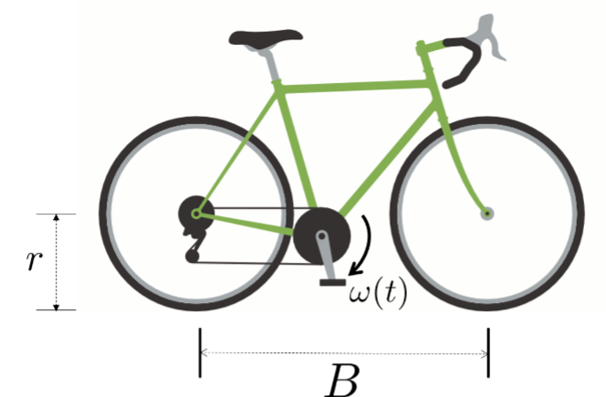
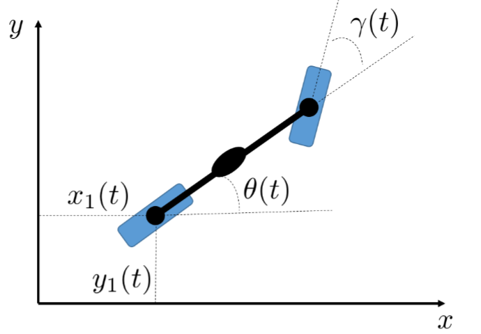
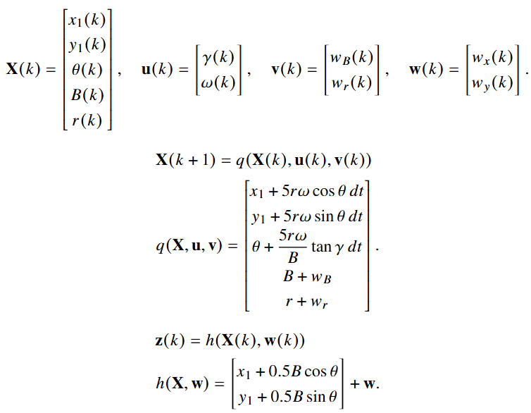
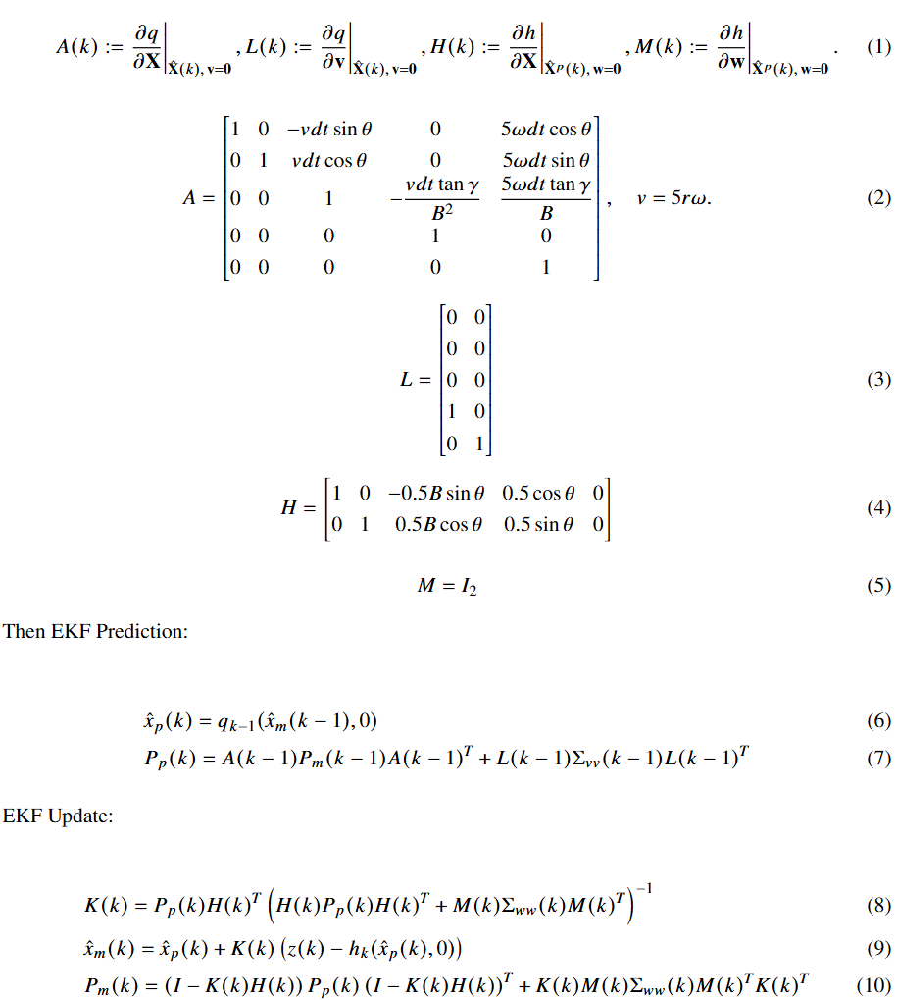
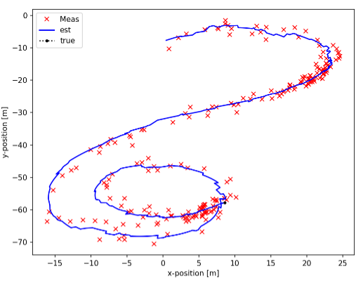
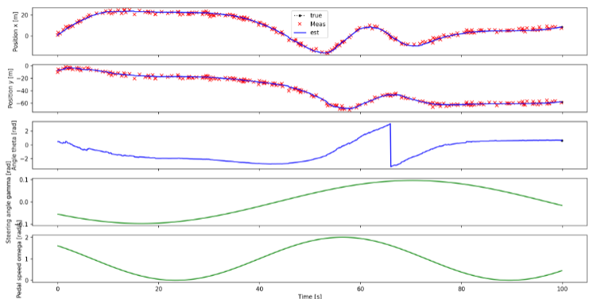

# E.K.F. Implement Template for Future Use

This project involves designing and implementing a state estimator to accurately track the position and heading of a bicycle over time, using noisy sensor data and uncertain physical parameters. The estimator must be computationally efficient, work under real-world conditions such as GPS noise and parameter variability, and demonstrate strong performance on unseen evaluation data. Anyway, main purpose of this repo is to provide a E.K.F. example template of system modeling, filtering, estimating. etc.

**See detailed problem, [Here](problem.pdf)**

|  |  |
| -----------------------| --------------------- |

### Detailed System Model Can Be Found [Here](report/report.pdf)

The system models a bicycle moving on a 2D plane, where the rear wheel position (𝑥,𝑦), heading angle 𝜃, wheelbase 𝐵, and tire radius 𝑟 evolve over time based on control inputs: steering angle 
𝛾(𝑡) and pedal speed 𝜔(𝑡). The dynamics are nonlinear and continuous, so we discretized them using Euler integration. To account for uncertainty in physical parameters, both 𝐵 and 𝑟 are treated as additional states to be estimated. The resulting discrete-time model captures the bicycle’s motion and measurements as a nonlinear state-space system suitable for recursive filtering.

### E.K.F. Implementation

### Results & Performance

This estimator shows strong performance on the evaluation dataset, achieving lower estimation errors in both position and heading compared to the instructor's baseline. The final errors in Run #1 are approximately 0.20 m in x, 0.04 m in y, and 0.05 rad in orientation—surpassing the benchmark in all metrics. Visual analysis further confirms the estimator's ability to closely track the true trajectory while filtering out measurement noise. Additionally, the implementation remains computationally efficient and satisfies all runtime constraints.

|  |  |
| ------------------------| --------------------- |

